# VFK-001
Valkyrie folded keyboard (folded vertical dactyl on full size mx silent swityches) with removable stabilizer
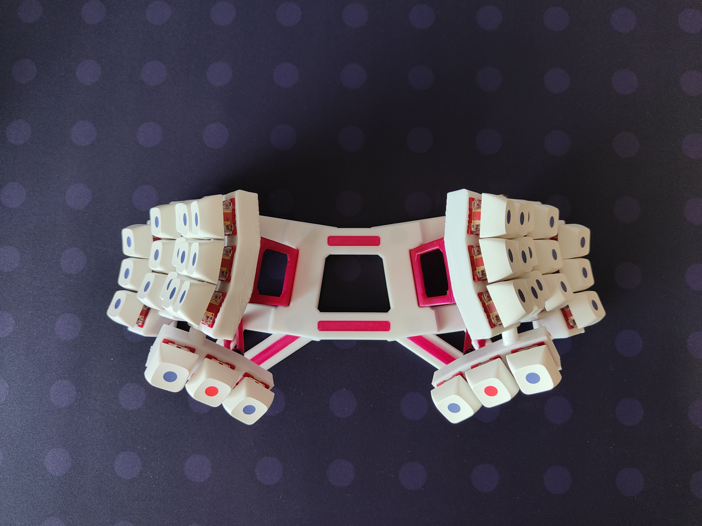

## Transformation
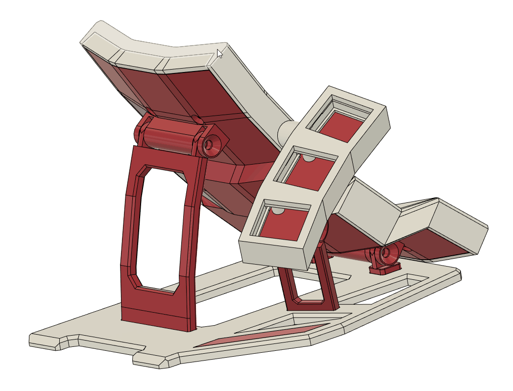

## Pilot hands 
I don't use hovering of hands or wrist rests. When typing, I keep my wrists on the table.
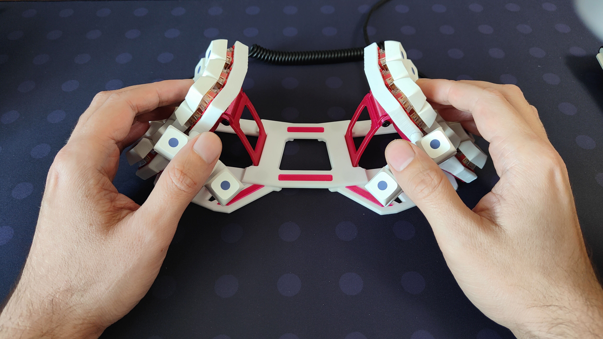

## BOM (BOM - Bill of Materials)
- 2 x Pro micro mcu
- 2 x Headphone Audio Socket PJ-320A
- 1 x 3.5 audio jack on 3.5 audio jack cable 
- 0.05 wire for hadnwires
- 36 x 1N4148 wire diodes
- 36 x Kailh hotswap socket 
- 36 x MX Switch (35g silent is best)
- Pet-g fillament, two colors :)
- 10 x m3 10mm hex screw (black is best)
- 16 x m2 5mm hex screw (black is best)
- 10 (14) x silicone bumpons 8mm 
- 8 x 10x2mm magnets for stabilizers mount

## Internal layout
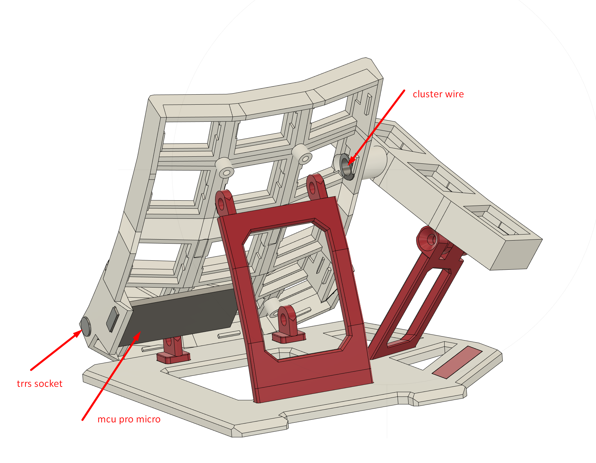

## Handwire matrix 
I'm building a matrix using sockets from kailh. Sockets give more reliability when soldering. Using a spatula to parse the phone, you can remove the switches without soldering. In this design, the bottom cover relies on the sockets too. The entire matrix is assembled from diodes. It works well.

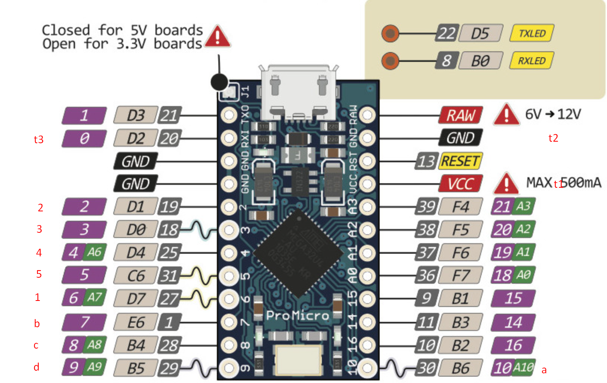

## Screws
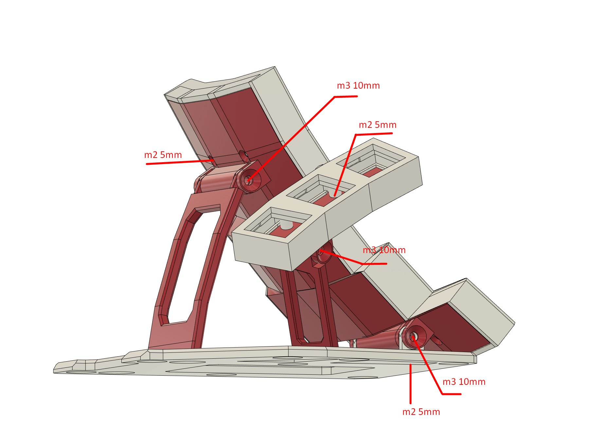

## Trackball option 
It was difficult. But I was able to add a trackball. It can still be folded, but the ball must be removed before folding.

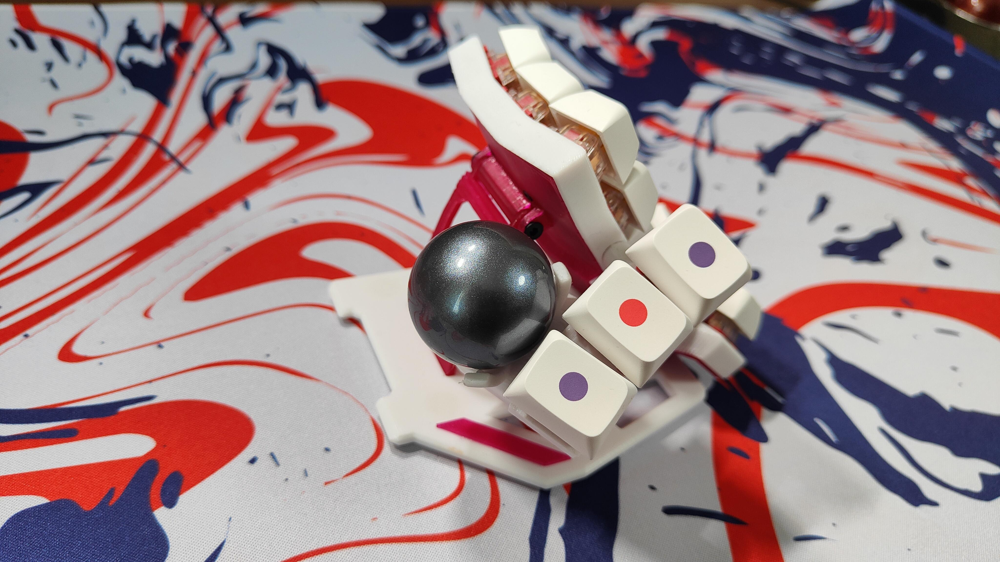
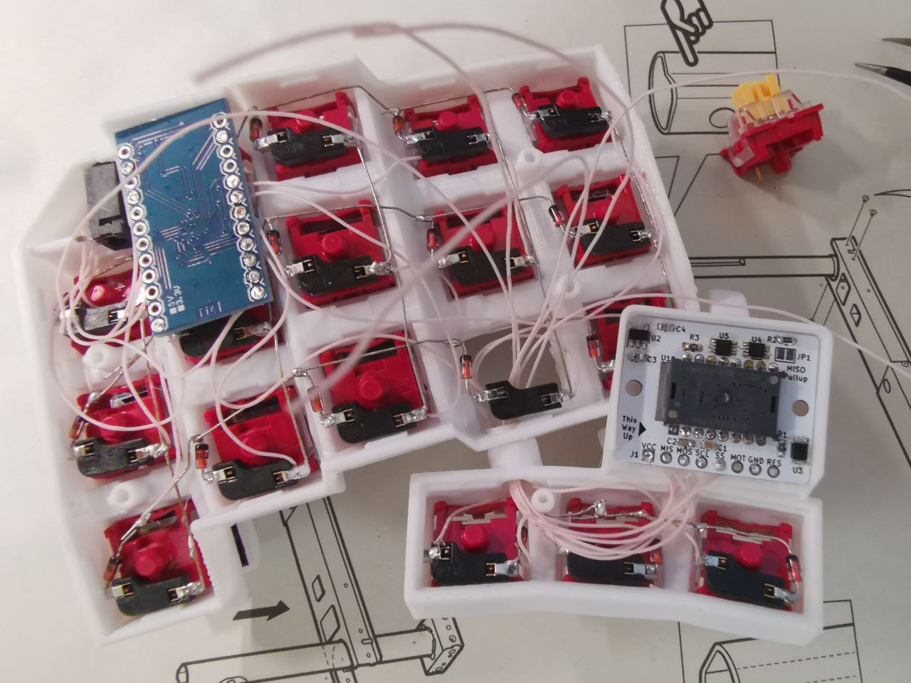
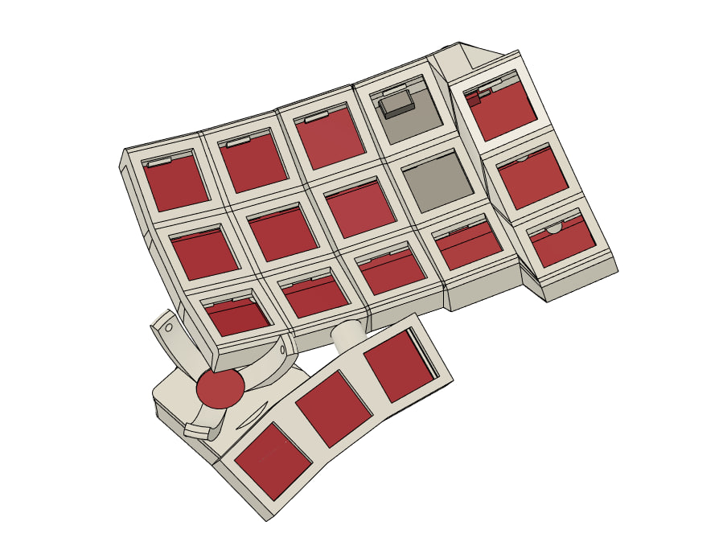

- I use Ogen project 3360 optical sensor - https://github.com/Ariamelon/Ogen 
- 34mm ball from Aliexpress
- 3 zrO2 ball static bearing

Cluster modifications file:
- Mofifed cluster in file - cluster tb.stl
- Trackball module bottom - cluster bottom tb.stl
- Full model with trackball cluseter - vfk-001 trackball 3360.step

## 3D Print
I used pet-g filament for printing and PrusaSlicer 2.5. I believe that it is necessary to use 3D glue to increase the adhesion of the printed table. I tried to make the keyboard as small as possible. Perhaps another filament will not be able to give the desired stiffness. It took me a while to print the arch and the bottom beautifully. Several models ended up in the trash can. I will attach a screenshot of the location of difficult to print models.
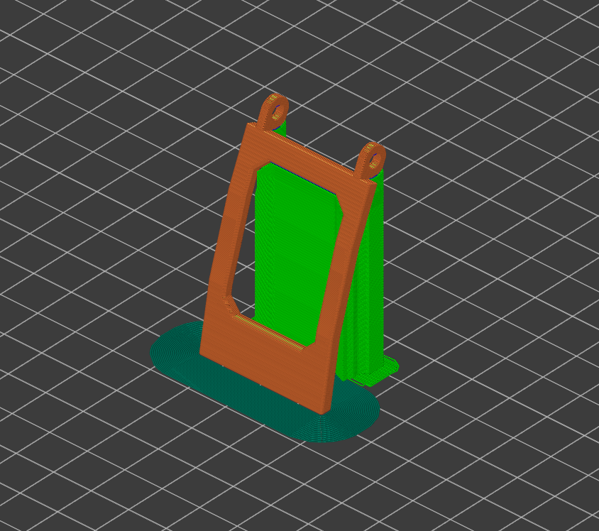
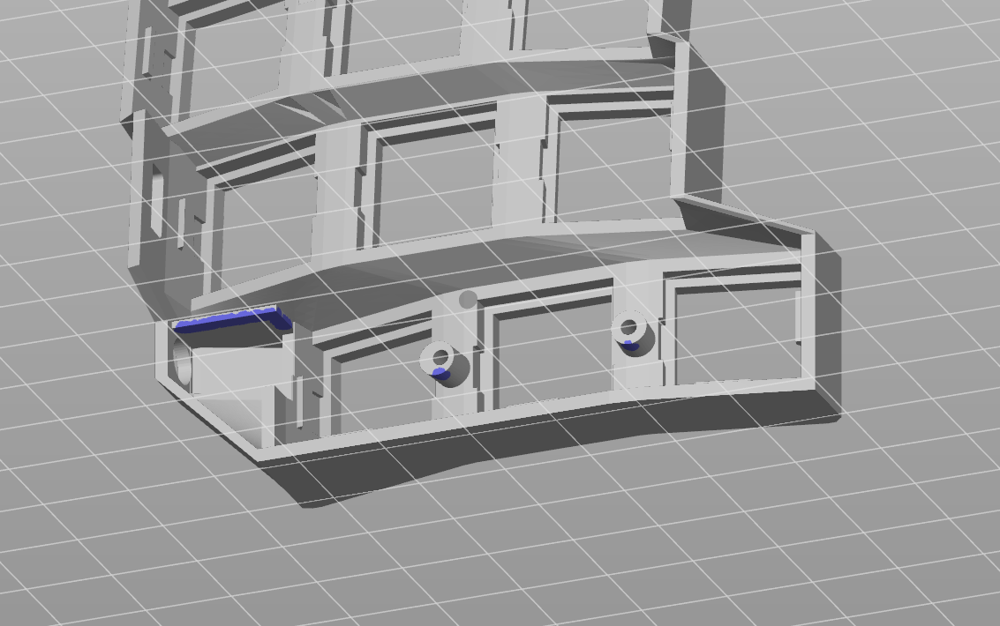
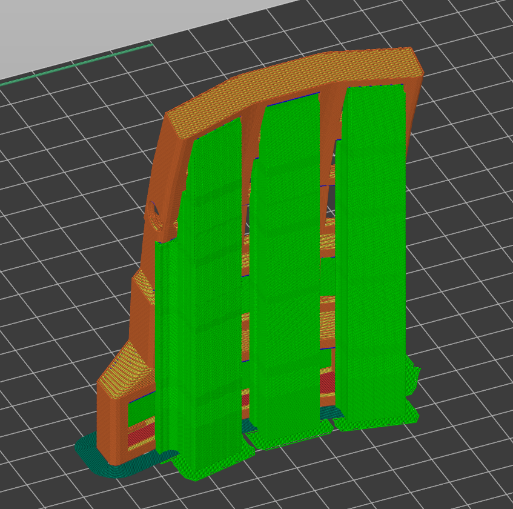
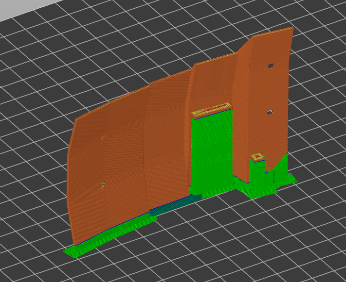
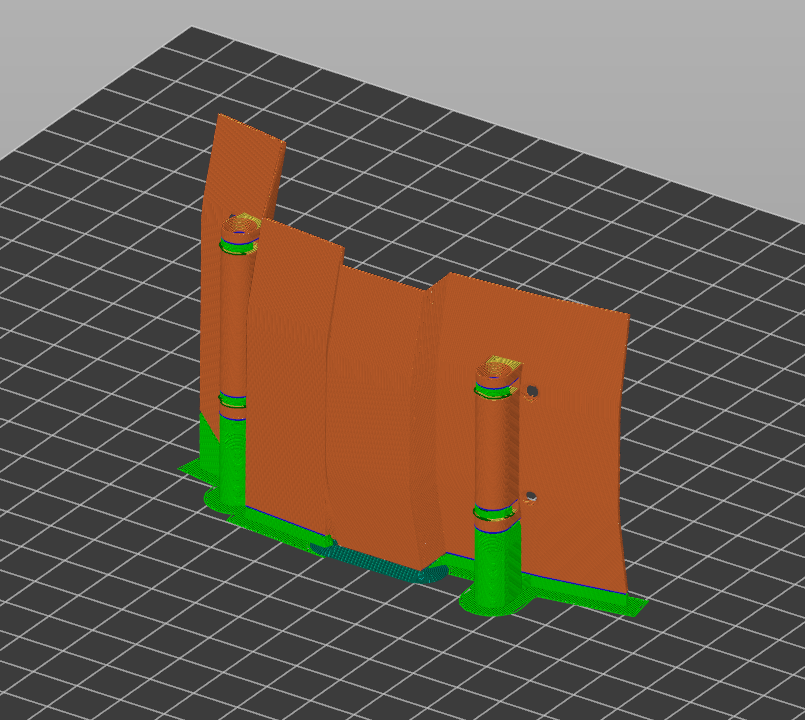

